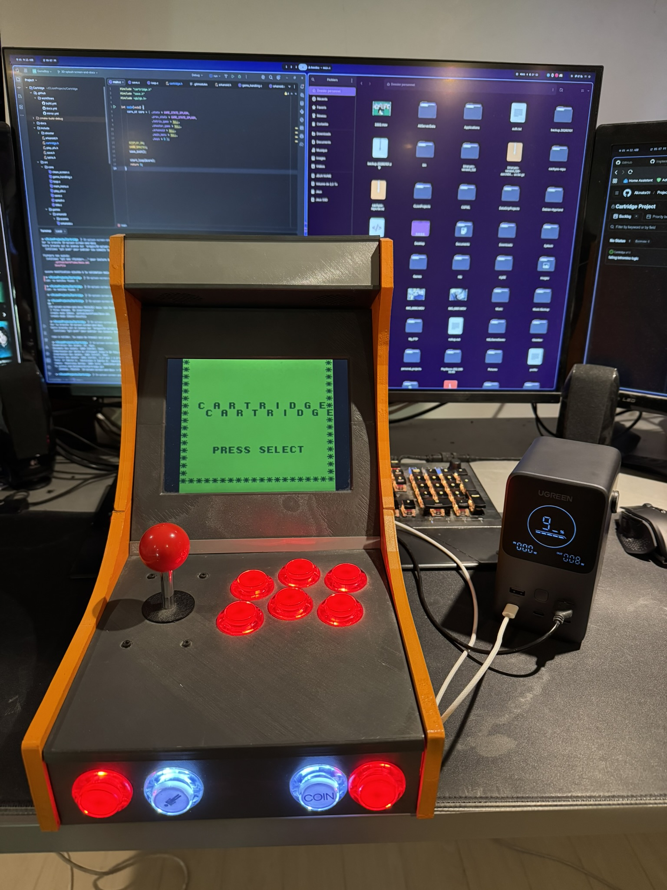

# Cartridge

<p align="center">
  
</p>

Cartridge is a multi-game project developed for the Nintendo Game Boy using the GBDK (Game Boy Development Kit). It features a collection of classic arcade games including Tetris, a Space Shooter, and Arkanoid, all accessible through a unified menu system.

## Project Structure

The project is organized into several key components:

- include/: Header files for the core engine and individual games.
- src/core/: Core engine logic, including state management, menu handling, and hardware initialization.
- src/games/: Implementation of the different games available on the cartridge.
- docs/: Documentation generated by Doxygen.

## Games Included

- Tetris: A classic block-matching puzzle game.
- Space Shooter: A fast-paced arcade shooter with waves of enemies.
- Arkanoid: A brick-breaking game featuring various levels and power-ups.

## Building the Project

### Prerequisites

To build the project, you need the GBDK (Game Boy Development Kit) installed on your system. The Makefile assumes GBDK is located at /opt/gbdk.

### Compilation

To compile the project and generate the ROM file (game.gb), run:

```bash
make
```

To clean the build artifacts, run:

```bash
make clean
```

To completely remove the ROM and build files, run:

```bash
make fclean
```

## Documentation

Documentation is generated using Doxygen. To generate the documentation, run:

```bash
doxygen Doxyfile
```

The output will be available in the docs/ directory.

## Controls

- D-Pad: Navigation in menus and movement in games.
- Start: Start games or skip splash screens.
- Select: Return to the main menu from any game or proceed from the title screen.
- A/B: Game-specific actions (e.g., rotating blocks, shooting).